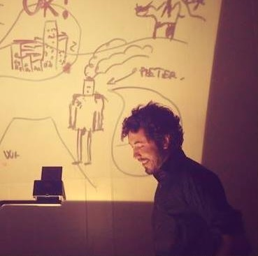
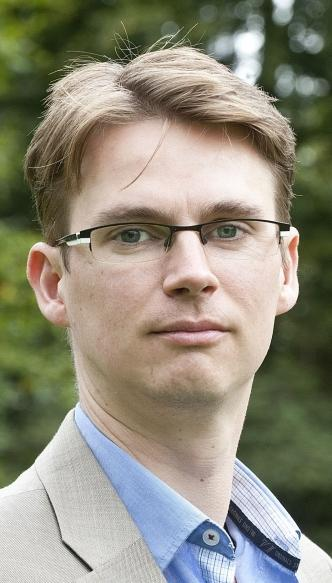
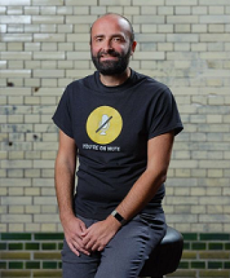
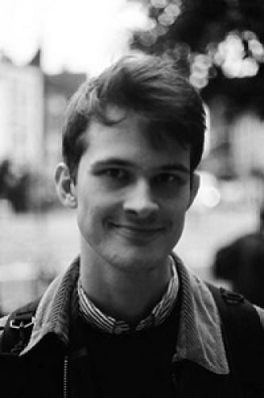
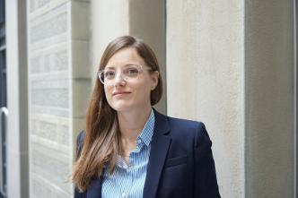

## Program Chair 

- Giovanni Sileno, University of Amsterdam

## Program Committee 

(Still updated)

- Michał Araszkiewicz, Jagiellonian University
- Kevin Ashley, University of Pittsburgh
- Katie Atkinson, University of Liverpool
- Trevor Bench-Capon, University of Liverpool
- Karim Benyekhlef, Université de Montréal
- Alexander Boer, KPMG
- Georg Borges, Universität des Saarlandes
- Karl Branting, The MITRE Corporation
- Ilaria Canavotto, University of Maryland
- Pompeu Casanovas, UAB
- Marcello Ceci, SnT - University of Luxembourg
- Giuseppe Contissa, University of Bologna
- Claudia d'Amato, University of Bari
- Massimo Durante, University of Turin
- Arthur Dyevre, Katholieke Universiteit Leuven
- Jenny Eriksson Lundström, Uppsala University
- Nicoletta Fornara, Università della Svizzera italiana
- Enrico Francesconi, IGSG-CNR
- Aldo Gangemi, Università di Bologna, CNR-ISTC
- Marco Giacalone, University of Naples Federico II
- Guido Governatori, Independent researcher
- Cristine Griffo, Free University of Bozen-Bolzano
- Davide Grossi, University of Groningen
- Jakub Harašta, Masaryk University
- Mustafa Hashmi, Data 61 , CSIRO
- John Horty, University of Maryland 
- Joris Hulstijn, University of Luxembourg
- John Joergensen, Rutgers University
- Jeroen Keppens, King's College London
- Francesca Lagioia, University of Bologna
- Tomer Libal, American University of Paris
- Réka Markovich, University of Luxembourg
- Denis Merigoux, INRIA
- Paulo Novais, University of Minho
- Gordon Pace, University of Malta
- Julian Padget, University of Bath
- Monica Palmirani, CIRSFID
- Radim Polčák, Masaryk University
- Henry Prakken, University of Utrecht, University of Groningen
- Paulo Quaresma, Universidade de Evora
- Antoni Roig, Autonomous University of Barcelona
- Antonino Rotolo, University of Bologna
- Cristiana Santos, Utrecht University
- Ken Satoh, National Institute of Informatics and Sokendai, Japan
- Jaromir Savelka, Carnegie Mellon University
- Clara Smith, UNLP, and UCALP
- Christoph Sorge, Saarland University
- Sarah Sutherland, Parallax Information Consulting
- Jolien Ubacht, Delft University of Technology
- Leon van der Torre, University of Luxembourg
- Tom Van Engers, University of Amsterdam
- Marc van Opijnen, KOOP
- Bart Verheij, University of Groningen
- Serena Villata, CNRS
- Vern Walker, Hofstra University
- Yueh-Hsuan Weng, Tohoku University
- Hannes Westermann, University of Montreal
- Adam Wyner, Swansea University
- Minghui Xiong, Zhejiang University
- John Zeleznikow, Victoria University
- Tomasz Zurek, T.M.C. Asser Institute, University of Amsterdam
- ...

## Doctoral Consortium Chairs 

- Monica Palmirani
- Michal Araszkiewicz

## Organizing Chairs 

**Gijs van Dijck**

**Jerry Spanakis**

**Konrad Kollnig**

**Aurelia Tamo-Larrieux**

