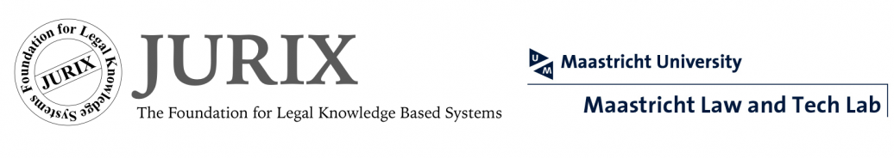

---
#
# By default, content added below the "---" mark will appear in the home page
# between the top bar and the list of recent posts.
# To change the home page layout, edit the _layouts/home.html file.
# See: https://jekyllrb.com/docs/themes/#overriding-theme-defaults
#
layout: home
---

Faculty of Law, Maastricht University, Maastricht, the Netherlands
Bouillonstraat 1–3
6211 LH Maastricht
18-20 December 2023 

This year, JURIX conference on Legal Knowledge and Information Systems will be hosted in Maastricht, the Netherlands and will take place on December 18-20, 2023. The Foundation for Legal Knowledge Based Systems (JURIX) is an organisation of researchers in the field of Law and Computer Science in the Netherlands and Flanders. Since 1988, JURIX has held annual international conferences on Legal Knowledge and Information Systems.

The proceedings of the conferences will be published in the Frontiers of Artificial Intelligence and Applications series of IOS Press. JURIX follows the Golden Standard and provides one of the best dissemination platforms in AI & law. 

**About the Event Organizer**
Maastricht University (UM) is the most international university in the Netherlands and, with nearly 22,000 students and 4,400 employees, is still growing. The university distinguishes itself with its innovative education model, international character and multidisciplinary approach to research and education. Today, it is considered one of the best young universities in the world. 

The local organizer of JURIX 2023 – [Maastricht Law and Tech Lab ](https://www.maastrichtuniversity.nl/about-um/faculties/law/research/law-and-tech-lab)– fosters a community of legal researchers and computer scientists who work collaboratively to integrate law and computer science methods.

**Contact details**

Faculty Of Law
Law Events Office
[Maud Houben-Nijssen](mailto:maud.houben-nijssen@maastrichtuniversity.nl) (for organisational matters)

*or*

[The Maastricht Law and Tech lab](mailto:law-techlab@maastrichtuniversity.nl) (for any content-related questions)

**Registration**
The registration will be open from 1 September 2023. Note that early registration rates apply until 30 November 2023. The proceedings will be published after the conference (see 'Proceedings'). 

