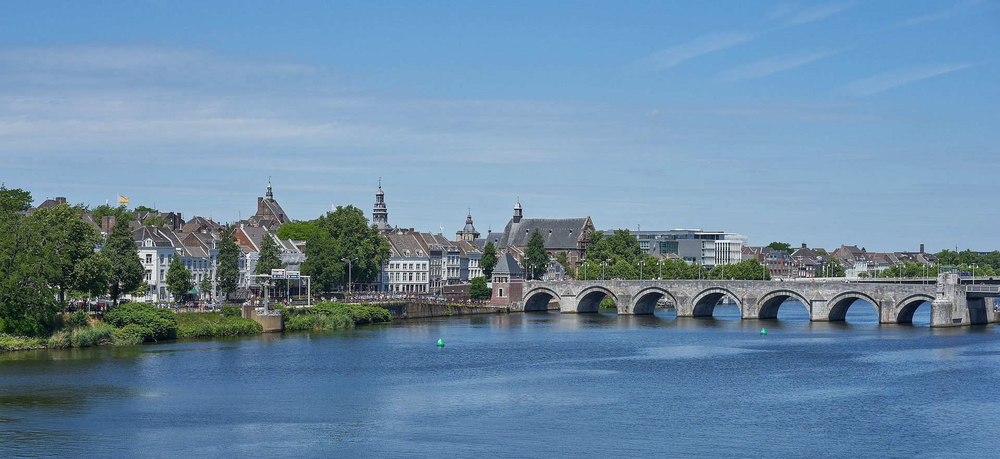

---
#
# By default, content added below the "---" mark will appear in the home page
# between the top bar and the list of recent posts.
# To change the home page layout, edit the _layouts/home.html file.
# See: https://jekyllrb.com/docs/themes/#overriding-theme-defaults
#
layout: home
---

Maastricht, the Netherlands 
18-20 December 2023

## About the Event

For more than 30 years, the JURIX conference has provided an international forum for research on the intersection of Law, Artificial Intelligence, and Information Systems, under the auspices of the JURIX Foundation for Legal Knowledge Systems.

JURIX is dedicated to exploring recent advancements, challenges, and opportunities of technologies applied to legal and para-legal activities. We invite submissions of original papers on legal information, legal knowledge systems, artificial intelligence and law, computational and socio-technical approaches to law, covering foundations, methods, tools, systems, interfaces, and applications. Papers should demonstrate added value, novelty of contribution and/or analysis, significance of the work, (formal) validity and/or proper evaluation.

This year, JURIX conference on Legal Knowledge and Information Systems will be hosted in Maastricht, the Netherlands and will take place on December 18-20, 2023. The Foundation for Legal Knowledge Based Systems (JURIX) is an organisation of researchers in the field of Law and Computer Science in the Netherlands and Flanders. Since 1988, JURIX has held annual international conferences on Legal Knowledge and Information Systems.

The proceedings of the conferences will be published in the Frontiers of Artificial Intelligence and Applications series of IOS Press. JURIX follows the Golden Standard and provides one of the best dissemination platforms in AI & law. 

Please note that presenters of papers accepted to the main conference are expected to be on-site to give their presentations and to interact with the audience. An online streaming option will be set-up for remote observers. Workshops may however run hybrid, at the discretion of their organizers (for further information, see their websites).

## About the Organizer

Maastricht University (UM) is the most international university in the Netherlands and, with nearly 22,000 students and 4,400 employees, is still growing. The university distinguishes itself with its innovative education model, international character and multidisciplinary approach to research and education. Today, it is considered one of the best young universities in the world. 

The local organizer of JURIX 2023 – [Maastricht Law and Tech Lab ](https://www.maastrichtuniversity.nl/about-um/faculties/law/research/law-and-tech-lab)– fosters a community of legal researchers and computer scientists who work collaboratively to integrate law and computer science methods.

## Address and Contact details
Faculty of Law, Maastricht University 
Bouillonstraat 1–3 
6211 LH Maastricht

**Organisational matters** 
Law Events Office 
[Elke Hundhausen](mailto:elke.hundhausen@maastrichtuniversity.nl)

**Content-related matters** 
[The Maastricht Law and Tech lab](mailto:law-techlab@maastrichtuniversity.nl)

## Registration
**The [registration](/registration) has now opened. Note that early registration rates apply until 30 November 2023.**

The proceedings will be published after the conference (see ['Proceedings'](/proceedings)). 

